# Certificates
Here are some of my certificates of learning:

-------------------
## SQLs
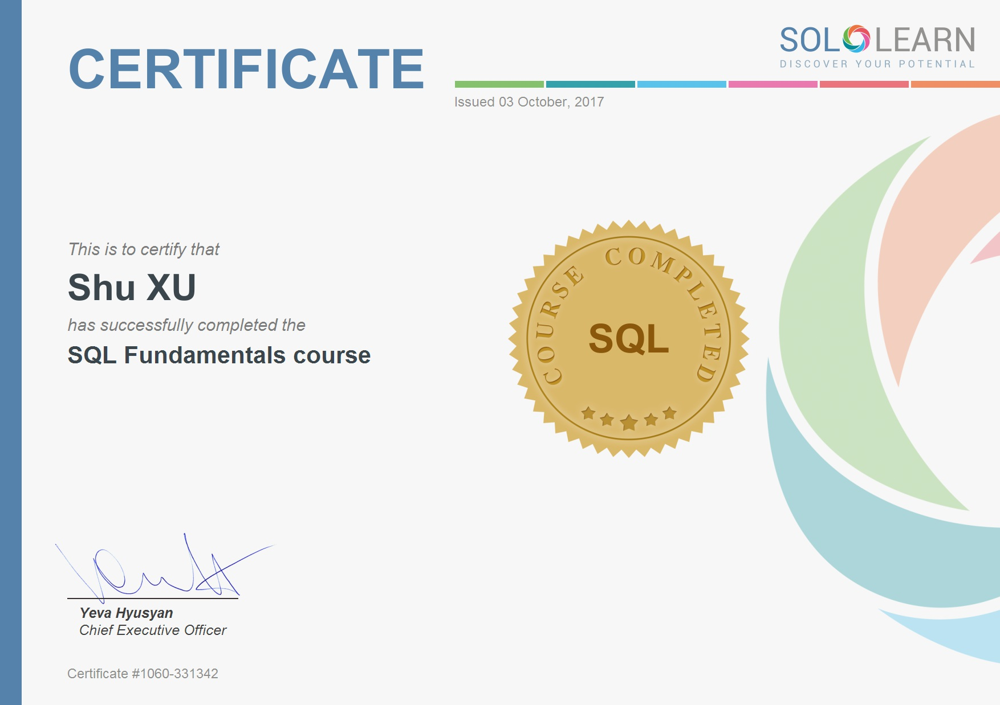
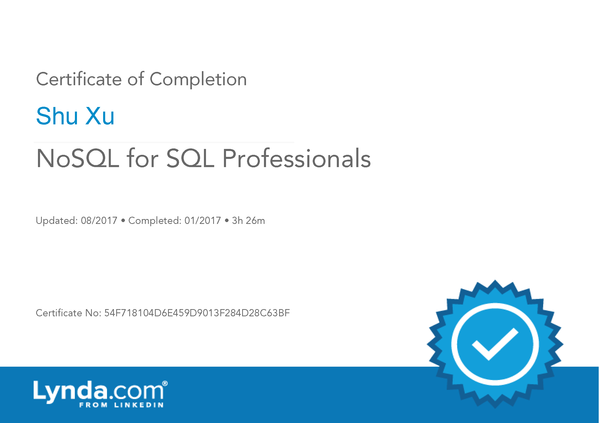

-------------------
## Web Full Stack
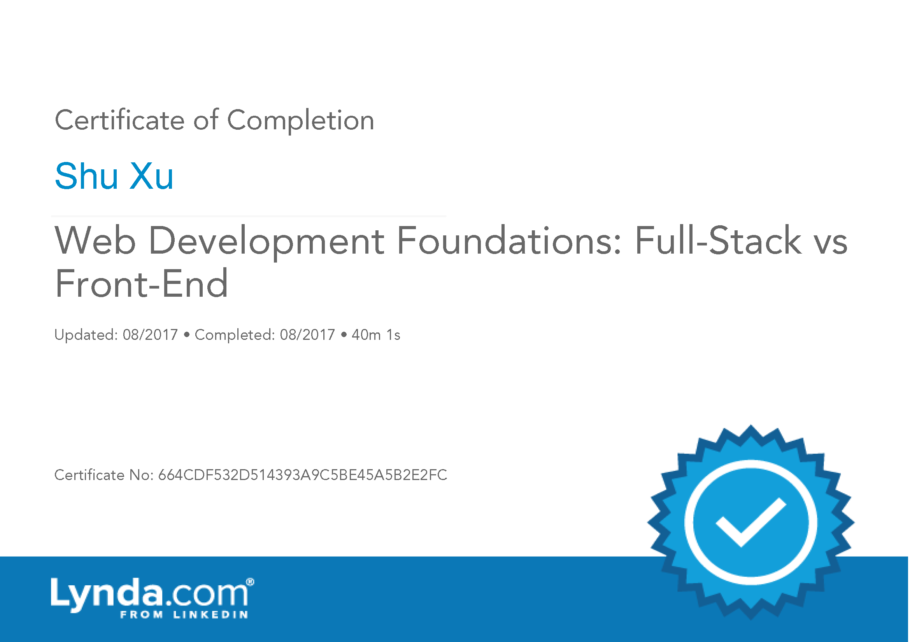

-------------------
## Alogrithms
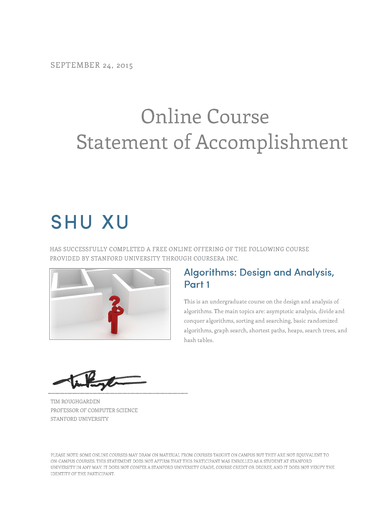

-------------------
## Java

-------------------
## Python
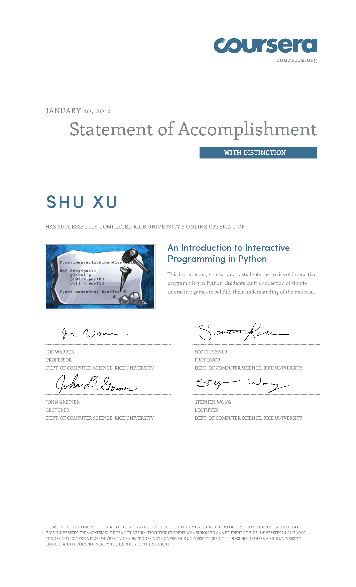
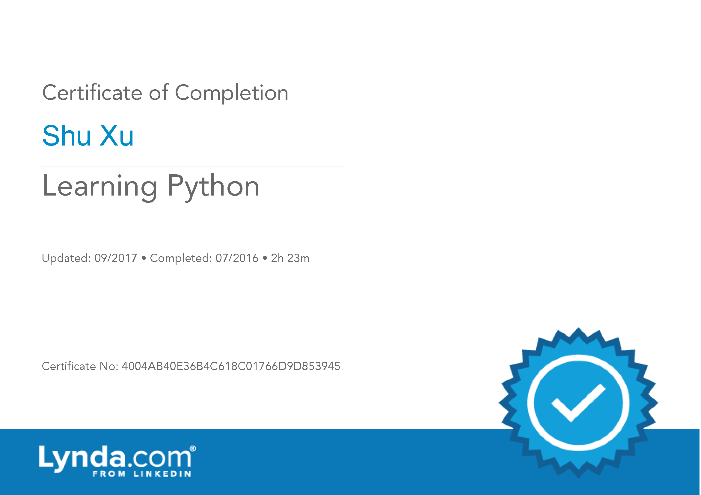
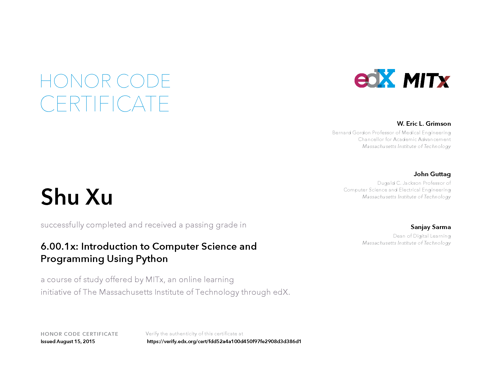

-------------------
## Raspberry pi
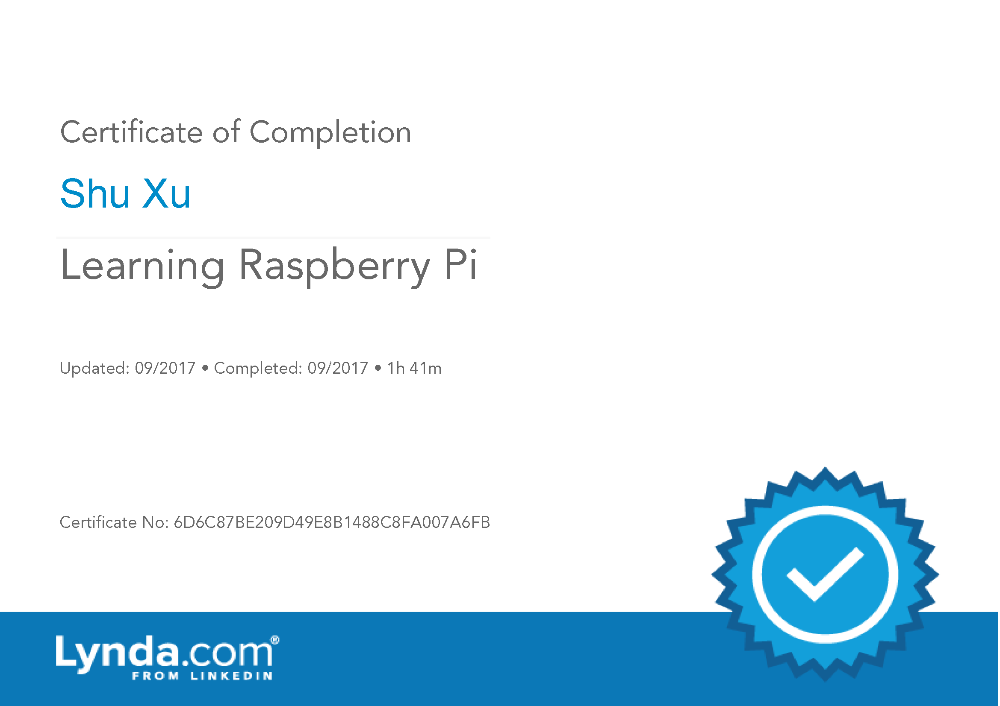

-------------------
## Design Pattern

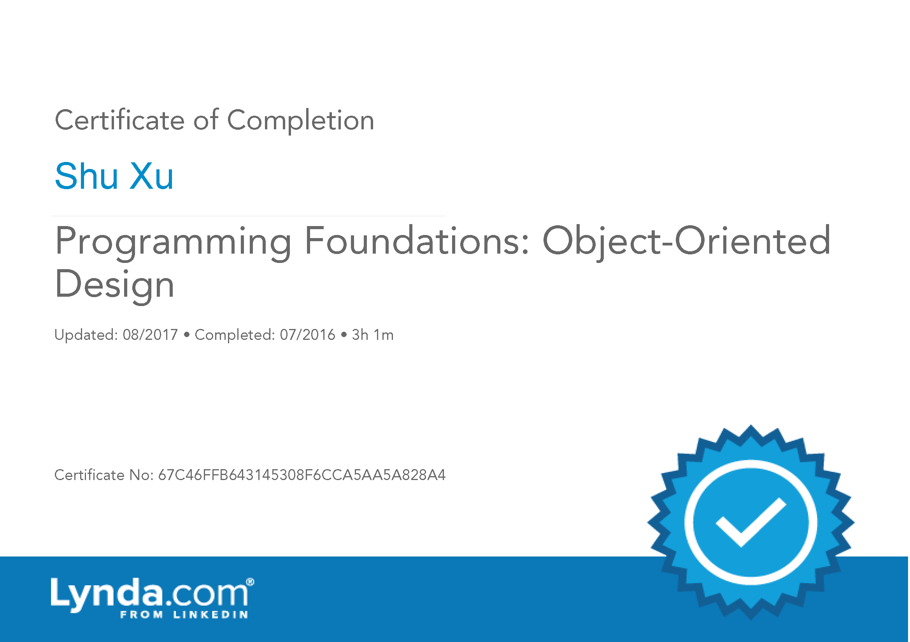

-------------------
## Data Analysis

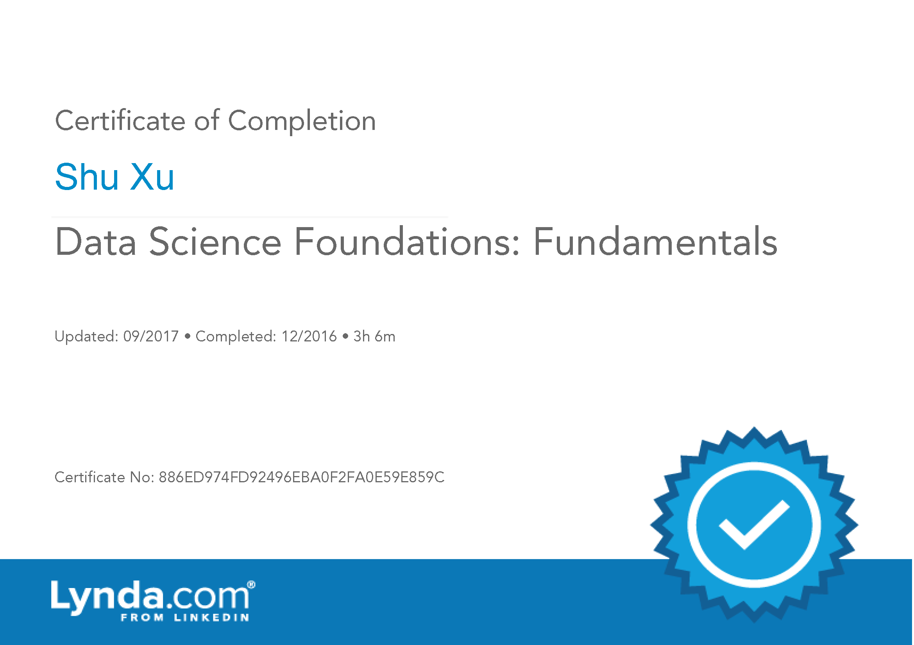
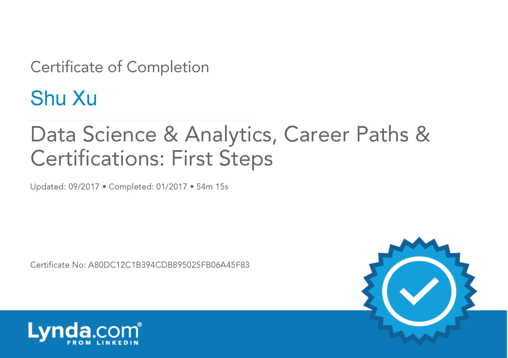
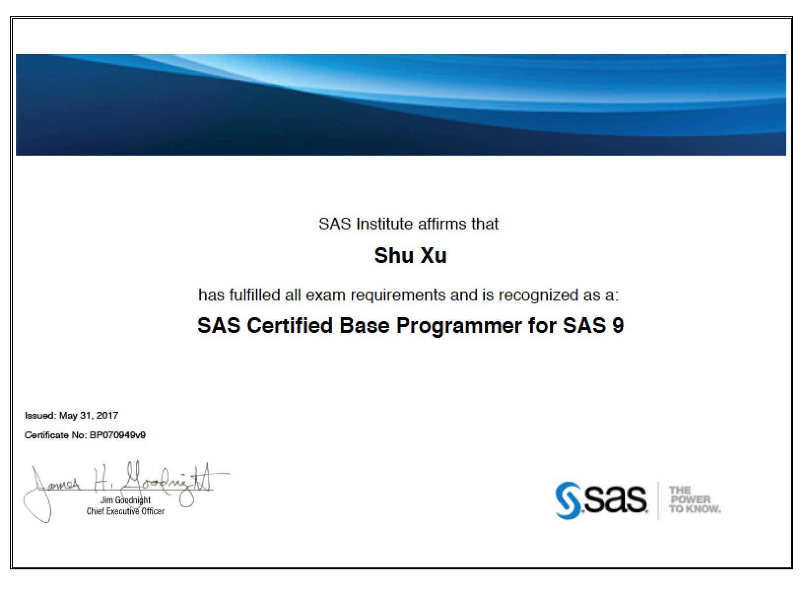
